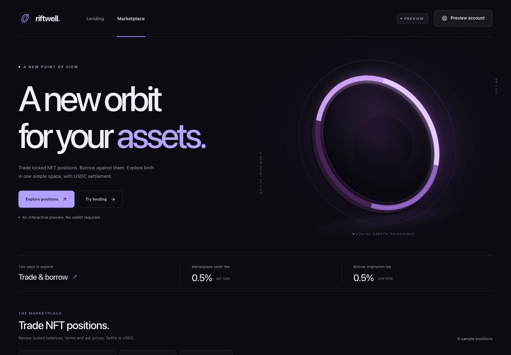

# Riftwell

[Live preview → ael-dev3.github.io/Riftwell](https://ael-dev3.github.io/Riftwell/)

A focused interface for NFT-backed lending and an NFT marketplace. Dark, quiet, and built around the idea of moving between positions with less friction.



## Direction

- Borrow against eligible NFTs, with terms and fees visible before committing.
- Discover, compare, and trade NFT positions in one clean marketplace.
- Start with one integration and build a reusable foundation for more collections.
- Keep the platform fee simple: 0.5% of a sale, or a one-time 0.5% of new loan principal. Lender interest is separate.

The current release is a deployable frontend preview. Its collections, prices, offers, balances, and activity are illustrative. Preview actions do not connect a wallet, request a signature, move funds, or deploy contracts.

## Run

Node.js 22.12+ or 24+ and npm are required.

```sh
npm ci --ignore-scripts
npm run dev
```

```sh
npm run check
npm run build
npm run preview
```

The frontend builds to `dist/`, ready for static hosting. No backend, API key, external fonts, remote images, analytics, or wallet connection is required. The included original SVG artwork is served locally. See [hosting notes](docs/HOSTING.md).

For the browser checks, start `npm run preview -- --port 5191` and run `npm run test:ui` in another terminal. The checks use an isolated installed Google Chrome session through Playwright. Set `RIFTWELL_PREVIEW_URL` to test another local preview URL. See [validation results](docs/VALIDATION.md).

## Source layout

- `src/` — React and TypeScript interface, preview data, and domain logic.
- `public/` — original brand mark and artwork.
- `prototypes/` — experimental Solidity, local EVM tests, and integration tooling.
- `docs/` — product direction, validation, and release boundaries.

```sh
npm ci --prefix prototypes --ignore-scripts
npm run contracts:compile
npm run contracts:test
```

The contract prototypes are **not deployed, independently audited, or approved for real funds**. They are published for development and review. The frontend does not use them. Remote fork tests are explicit opt-in and write only to an isolated local fork. See [prototype boundaries](prototypes/README.md).

## License

Original Riftwell source and artwork use Apache 2.0. Upstream dependencies retain their own licenses and notices. Branding and third-party collection rights are separate from software permissions.
