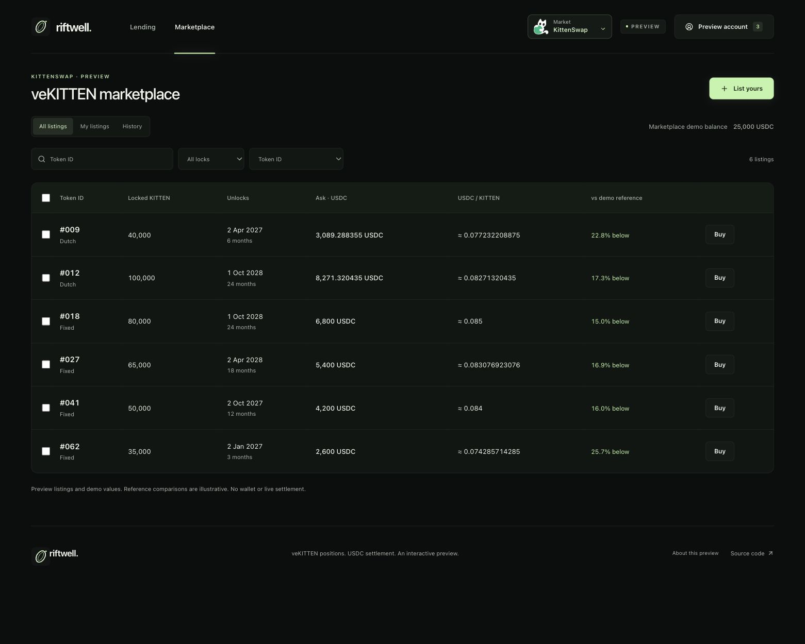

# Riftwell

[Live preview → ael-dev3.github.io/Riftwell](https://ael-dev3.github.io/Riftwell/)

Collateral credit lines, pooled USDC lending and a focused marketplace, starting with KittenSwap on HyperEVM. Dark surfaces, a light-green accent and a quiet portal theme.



## Application

Two build modes share the interface:

- **Preview:** GitHub Pages uses a listings table with sample NFTs, fixed-price and Dutch listings, seller management, purchase and sweep reviews, and a separate pooled lending simulation. All preview balances and ownership are local examples.
- **Connected:** the Node service supports wallet sign-in, confirmed veKITTEN ownership reads and persistent marketplace listings. The lending view reports its undeployed status without inventing liquidity, credit or yield.

Marketplace listings are off-chain expressions of interest. Funded purchases and lending are unavailable until compatible contracts are separately released. No application route requests token approvals, transfers NFTs or sends transactions. Earlier unfunded lending requests/offers are retained only for history and cancellation.

Lending uses a shared vault: borrowers draw against collateral reward income; suppliers hold vault shares whose withdrawals depend on available liquidity. There is no fixed loan APR or maturity. Read the [lending model and release boundary](docs/LENDING.md). The existing Solidity prototypes remain unchanged and do not implement this pooled execution model.

## Run locally

Use Node.js 24 and npm. The application and tooling use TypeScript 7.0.2 with strict checks. Frontend, server and experimental prototypes have separate lockfiles. Node runs the server and tools using native type stripping; CI checks types separately.

```sh
npm ci --ignore-scripts
npm ci --prefix server
npm run dev
```

To run the connected application at `http://127.0.0.1:8080`:

```sh
VITE_APP_MODE=connected npm run build
APP_ORIGIN=http://127.0.0.1:8080 npm --prefix server start
```

The development database is `server/data/riftwell.sqlite`. Authentication supports EOA accounts through an Ethereum browser wallet on HyperEVM (chain 999). Open the site inside a compatible mobile wallet browser or use an extension. Desktop WalletConnect and contract-wallet authentication are not implemented.

```sh
npm run check
npm --prefix server test
npm run format:check
```

To check the separate prototype toolchain as well:

```sh
npm ci --prefix prototypes --ignore-scripts
npm run typecheck:all
```

Read [deployment and operations](docs/OPERATIONS.md), the [API contract](docs/API.md), [hosting modes](docs/HOSTING.md) and [validation scope](docs/VALIDATION.md). The Docker deployment supplies HTTPS configuration, persistent storage and health checks. A production host, domain and suitable RPC endpoint must still be configured and verified.

## Source

- `src/` — React interface, preview logic and connected API/wallet client.
- `server/` — authentication, SQLite persistence, order APIs and read-only chain adapter.
- `deploy/` — single-instance Docker Compose and HTTPS reverse proxy.
- `public/` — original artwork and supplied KittenSwap logo.
- `prototypes/` — experimental Solidity and local integration tooling.

The Solidity prototypes are not deployed, independently audited or approved for real funds. They are not used by the running application and remain a separate release. See [prototype boundaries](prototypes/README.md).

## License

Original source and artwork use Apache 2.0. Dependencies retain their own licenses and notices. Branding and collection rights are separate from software permissions.
